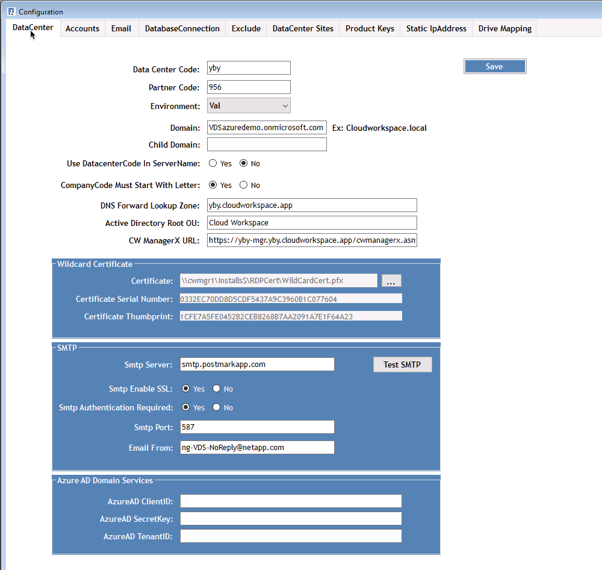
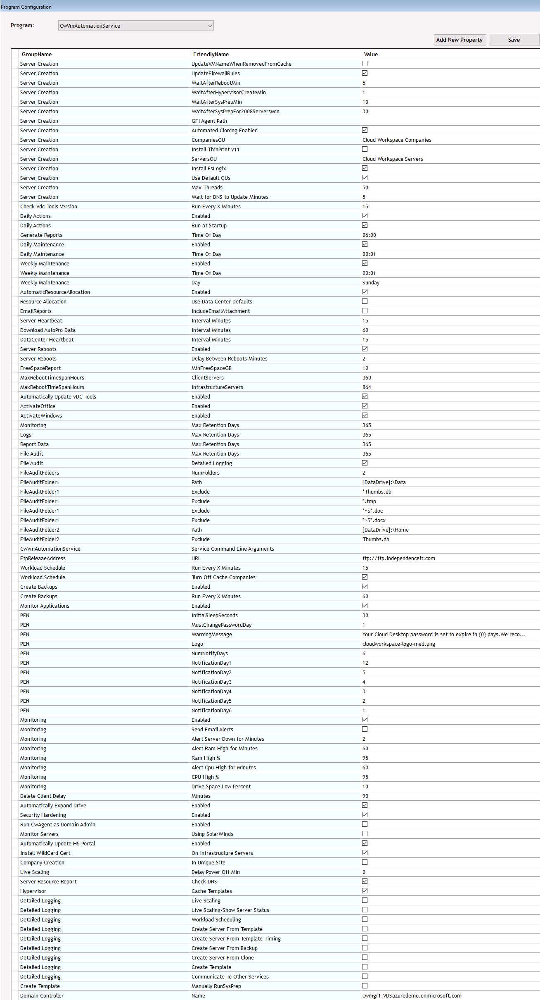

= Descripción general
:allow-uri-read: 

== Descripción general

DCConfig es una utilidad de configuración de la máquina virtual CWMGER1 que se utiliza para establecer y cambiar muchos valores de configuración de toda la implementación.

. Conéctese a la máquina virtual CWMGER1 como administrador
. Ejecute la aplicación desde el acceso directo del escritorio

En la aplicación hay tres secciones principales: Configuración, Avanzado y Ayuda.

=== Configuraciones

La ventana configuraciones se abre en el inicio y tiene varias subsecciones

==== Centro de datos

==== Cuentas

image::images/Management.dcconfig.dcconfig.overview-f34a2.png[Management.dcconfig.dcconfig.overview f34a2]

==== Correo electrónico

image::images/Management.dcconfig.dcconfig.overview-4b3be.png[Management.dcconfig.dcconfig.overview 4b3be]

==== Conexión de base de datos

image::images/Management.dcconfig.dcconfig.overview-80da7.png[Management.dcconfig.dcconfig.overview 80da7]

==== Excluir

image::images/Management.dcconfig.dcconfig.overview-0f30e.png[Management.dcconfig.dcconfig.overview 0f30e]

==== Sitios del centro de datos

image::images/Management.dcconfig.dcconfig.overview-95b21.png[Management.dcconfig.dcconfig.overview 95b21]

==== Claves de producto

image::images/Management.dcconfig.dcconfig.overview-298a0.png[Management.dcconfig.dcconfig.overview 298a0]

==== Dirección IP estática

image::images/Management.dcconfig.dcconfig.overview-7e4a4.png[Management.dcconfig.dcconfig.overview 7e4a4]

==== Asignación de unidades

image::images/Management.dcconfig.dcconfig.overview-60fd2.png[Management.dcconfig.dcconfig.overview 60fd2]

=== Avanzada

La ventana Avanzado muestra una lista de valores que se pueden editar desde esta interfaz.

[cols="33,33,33"]
|===
| Grupo | FriendlyName | Valor 

| Grupo | FriendlyName | Valor 

| Creación del servidor | UpdateVMNameWhenRemovedFromCache | Verdadero/Falso 

| Creación del servidor | UpdateFirewallRules | Verdadero/Falso 

| Creación del servidor | WaitAfterRebootMin | <# minutos> 

| Creación del servidor | WaitAfterHypervisorCreateMin | <# minutos> 

| Creación del servidor | WaitAfterSysPrepMin | <# minutos> 

| Creación del servidor | WaitAfterSysPrepFor2008ServersMin | <# minutos> 

| Creación del servidor | GFI Agent Path |  

| Creación del servidor | Clonado automatizado habilitado | Verdadero/Falso 

| Creación del servidor | CompañíaOU | <String - Companines OU Name> 

| Creación del servidor | Instale ThinPrint v11 | Verdadero/Falso 

| Creación del servidor | ServersoOU | <String - Servers OU Name> 

| Creación del servidor | Instalar FsLogix | Verdadero/Falso 

| Creación del servidor | Utilice unidades organizativas predeterminadas | Verdadero/Falso 

| Creación del servidor | Número máx. De subprocesos | <#> 

| Creación del servidor | Espere a que DNS actualice los minutos | <# minutos> 

| Compruebe la versión de las herramientas de V dc | Corre cada X minutos | <# minutos> 

| Acciones diarias | Activado | Verdadero/Falso 

| Acciones diarias | Ejecutar al inicio | Verdadero/Falso 

| Generar informes | Hora del día | <TIME 00:00> 

| Mantenimiento diario | Activado | Verdadero/Falso 

| Mantenimiento diario | Hora del día | <TIME 00:00> 

| Mantenimiento semanal | Activado | Verdadero/Falso 

| Mantenimiento semanal | Hora del día | <TIME 00:00> 

| Mantenimiento semanal | Día | <day of the week> 

| AutomaticResourceAllocation | Activado | Verdadero/Falso 

| Asignación de recursos | Utilice valores predeterminados del centro de datos | Verdadero/Falso 

| EmailReports | Incluir EmailAttachment | Verdadero/Falso 

| Latido del servidor | Intervalo de minutos | <# minutos> 

| Descargar AutoPro Data | Intervalo de minutos | <# minutos> 

| Latido del centro de datos | Intervalo de minutos | <# minutos> 

| El servidor se reinicia | Activado | Verdadero/Falso 

| El servidor se reinicia | Retraso entre reinicios minutos | <# minutos> 

| Informe FreeSpaceReport | MinFreeSpaceGB | <# umbral mínimo GB> 

| MaxRebootTimeSpanHours | ClientServers | <# horas antes del reinicio requerido> 

| MaxRebootTimeSpanHours | Infraestructurade servidores | <# horas antes del reinicio requerido> 

| Actualizar automáticamente las herramientas de VDC | Activado | Verdadero/Falso 

| ActivateOffice | Activado | Verdadero/Falso 

| ActivateWindows | Activado | Verdadero/Falso 

| Supervisión | Max Retention Days | <# días> 

| Registros | Max Retention Days | <# días> 

| Datos del informe | Max Retention Days | <# días> 

| Auditoría de archivos | Max Retention Days | <# días> 

| Auditoría de archivos | Registro detallado | Verdadero/Falso 

| FileAuditFolders | Carpetas de números | 2 

| FileAuditFolder1 | Ruta | [DataDrive]:\datos 

| FileAuditFolder1 | Excluir | *Thumbs.dB 

| FileAuditFolder1 | Excluir | *.tmp 

| FileAuditFolder1 | Excluir | *~$*.doc 

| FileAuditFolder1 | Excluir | *~$*.docx 

| FileAuditFolder2 | Ruta | [DataDrive]:\Home 

| FileAuditFolder2 | Excluir | Thumbs.dB 

| CwVmAutomationService | Argumentos de la línea de comandos de servicio |  

| FtplitaaeAddress | URL | <ftp URL> 

| Programación de cargas de trabajo | Corre cada X minutos | <# minutos> 

| Programación de cargas de trabajo | Desactivar Empresas de caché | Verdadero/Falso 

| Crear backups | Activado | Verdadero/Falso 

| Crear backups | Corre cada X minutos | <# minutos> 

| Supervisar aplicaciones | Activado | Verdadero/Falso 

| LÁPIZ | InitialSleepSeconds | <# segundos> 

| LÁPIZ | MustChangePasswordDay | <# días antes de expirar para el restablecimiento forzado de PW> 

|  |  | <Password reset text string> 

| LÁPIZ | De NetApp | <local .png logo path> 

| LÁPIZ | Número de NotifyDays | <# días> 

| LÁPIZ | NotificationDay1 | <# días antes de expirar para la notificación> 

| LÁPIZ | NotificationDay2 | <# días antes de expirar para la notificación> 

| LÁPIZ | NotificationDay3 | <# días antes de expirar para la notificación> 

| LÁPIZ | NotificationDay4 | <# días antes de expirar para la notificación> 

| LÁPIZ | NotificationDay5 | <# días antes de expirar para la notificación> 

| LÁPIZ | NotificationDay6 | <# días antes de expirar para la notificación> 

| Supervisión | Activado | Verdadero/Falso 

| Supervisión | Enviar alertas por correo electrónico | Verdadero/Falso 

| Supervisión | Servidor de alertas inactivo durante minutos | <# minutos> 

| Supervisión | Alerta de RAM alta durante minutos | <# minutos> 

| Supervisión | % De RAM alto | <RAM % Threshold> 

| Supervisión | Alerta de CPU alta durante minutos | <# minutos> 

| Supervisión | % De CPU alto | <CPU % Threshold> 

| Supervisión | Porcentaje bajo de espacio en la unidad | <Disk Space Free % Threshold> 

| Eliminar retraso del cliente | Minutos | <# minutos> 

| Expanda Unidad automáticamente | Activado | Verdadero/Falso 

| Seguridad reforzada | Activado | Verdadero/Falso 

| Ejecute CwAgent como administrador de dominio | Activado | Verdadero/Falso 

| Supervisar servidores | Uso de SolarWinds | Verdadero/Falso 

| Actualizar automáticamente el portal H5 | Activado | Verdadero/Falso 

| Instale el comodín Cert | En servidores de infraestructura | Verdadero/Falso 

| Creación de empresas | En un sitio único | Verdadero/Falso 

| Escalado en directo | Retardo de apagado mínimo | <# minutos> 

| Informe de recursos de servidor | Compruebe DNS | Verdadero/Falso 

| Hipervisor | Plantillas de caché | Verdadero/Falso 

| Registro detallado | Escalado en directo | Verdadero/Falso 

| Registro detallado | Escala en directo: Mostrar el estado del servidor | Verdadero/Falso 

| Registro detallado | Programación de cargas de trabajo | Verdadero/Falso 

| Registro detallado | Crear servidor a partir de plantilla | Verdadero/Falso 

| Registro detallado | Crear servidor a partir de la sincronización de plantillas | Verdadero/Falso 

| Registro detallado | Crear servidor a partir de copia de seguridad | Verdadero/Falso 

| Registro detallado | Crear servidor a partir de Clonar | Verdadero/Falso 

| Registro detallado | Crear plantilla | Verdadero/Falso 

| Registro detallado | Comunicarse con otros Servicios | Verdadero/Falso 

| Crear plantilla | RunSysPrep manualmente | Verdadero/Falso 

| Controlador de dominio | Nombre | cwmgr1.<domain.com> 
|===

=== Ayuda

Abre el archivo de ayuda local.
